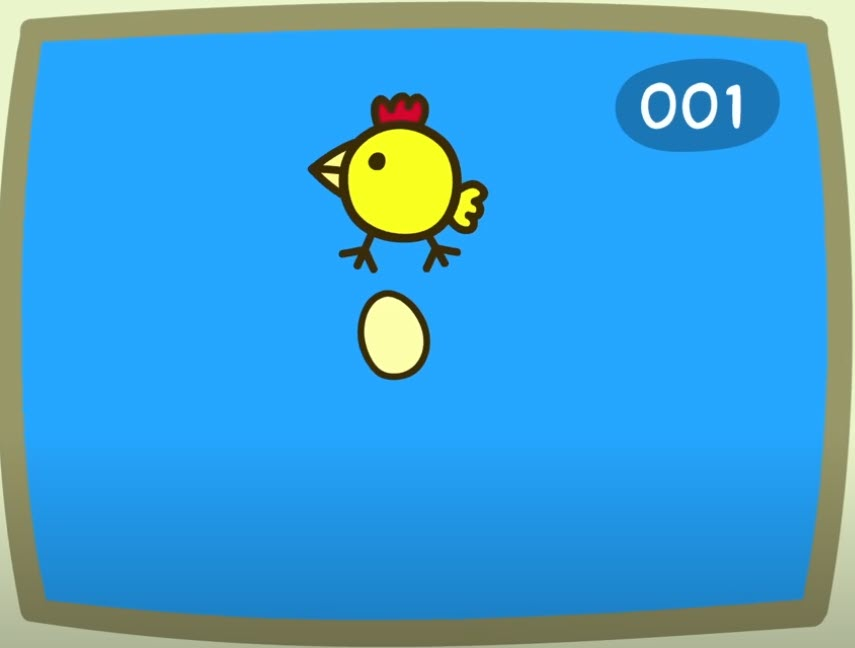

# 🐔 Happy Ms. Chicken Deluxe: The Clucktastic Egg-stravaganza! 🥚🎉
(from Peppa Pig)

*(Imagine this, but with WAY more chickens... and fart sounds!)*

Welcome to **Happy Ms. Chicken Deluxe**, where your primary goal is to... well, make Ms. Chicken happy by helping her lay an *absurd* number of eggs! And then watch as those eggs hatch into more chickens (and roosters!), who then lay *even more* eggs (if they're hens, of course). It's the circle of cluck! 🐣➡️🐔➡️🥚➡️🐣

This isn't just a game; it's an experience. A symphony of poop toots with every egg laid. A visual ballet of chickens gallivanting across your screen. A testament to the exponential power of poultry!

## 🌟 Features That'll Make You Crow!

*   **Interactive Egg Laying:** You control the star of the show, Ms. Chicken! Click your mouse or tap that spacebar to make her lay an egg. Each egg is a victory! 🏆
*   **Autonomous Chicken Empire:** Watch in awe as your initial efforts snowball! Chicklets hatch, grow into adult hens (or strapping roosters), and the hens start contributing to the egg count all on their own!
*   **Dynamic Population:** Chickens, chickens everywhere! But don't worry, you can control the chaos (somewhat).
*   **Hens AND Roosters! 🐓:** Not every chicklet grows up to be an egg-layer. Some become proud roosters, adding to the farmyard ambiance with their dapper looks (and different colored combs/bodies!). They might not lay eggs, but they sure do strut their stuff!
*   **Customizable Chaos with Sliders! 🎛️:**
    *   **Grow Time:** How fast do your little chicklets mature into full-blown egg-laying machines (or roosters)? YOU DECIDE! From speedy growers to late bloomers.
    *   **Max Chickens:** Feeling overwhelmed? Or is your computer fan starting to sound like a jet engine? Cap the total number of chickens allowed on screen. Sanity is optional, but available.
*   **Symphony of Sounds 🎶🎺:**
    *   An absolutely *essential* intro tune to set the mood.
    *   The most satisfying (and possibly hilarious) **tuba toot** accompanies every single egg laid. You'll never think of egg-laying the same way again.
*   **Real-time Counters:** Keep track of your egg-laying prowess!
    *   **Your Score:** How many eggs has YOUR Ms. Chicken laid?
    *   **Total Chickens:** See the current chicken population, including your player, hens, and roosters, and how close you are to the cap.
    *   **Total Eggs Laid EVER:** A running tally of every single egg that has graced the screen. Aim for the high score!
    *   **Hen & Rooster Count:** Know your flock's demographics!
*   **Visually Appealing (in a chaotic, chicken-filled way):** Cute, cartoonish chickens and eggs fill your screen with joy (and feathers, probably). Roosters even get their own distinct look with different body colors, more prominent combs, wattles, and even a little tail!

## 🕹️ How to Play (It's EGG-ceptionally Easy!)

1.  **Get the Goods:**
    *   Clone this repository or download the files.
    *   Make sure you have `happychicken.html` and the `assets` folder (containing `intro_song.mp3` and `tuba_sound.mp3`) in the same directory.

2.  **Fire Up a Local Server (Super Important for Sounds!):**
    *   Browsers are a bit fussy about loading local sound files directly (`file:///`). To make them happy, you need to serve the game from a local web server.
    *   **Easiest Way (if you use VS Code):**
        *   Install the "Live Server" extension in VS Code.
        *   Right-click on `happychicken.html` and choose "Open with Live Server."
    *   **Python Power-Users:**
        *   Open a terminal/command prompt in the game's folder.
        *   Run `python -m http.server` (for Python 3) or `python -m SimpleHTTPServer` (for Python 2).
        *   Open your browser to `http://localhost:8000/happychicken.html`.
    *   **Node.js Ninjas:**
        *   Open a terminal/command prompt in the game's folder.
        *   If you don't have it, install `npm install -g http-server`.
        *   Run `http-server`.
        *   Open your browser to the address it gives you (e.g., `http://localhost:8080/`) and ensure you navigate to `happychicken.html` if it doesn't open automatically.

3.  **Let the Clucking Commence!**
    *   Once the game loads in your browser, you'll see Ms. Chicken.
    *   **Move your mouse:** Ms. Chicken follows your cursor.
    *   **Click the mouse OR press the Spacebar:** Ms. Chicken lays an egg (accompanied by a glorious tuba toot)! Your score goes up!
    *   **Watch the magic:** Eggs will hatch into chicklets. Chicklets will grow. Hens will start laying their own eggs. Roosters will... well, they'll look handsome.
    *   **Tweak the Sliders:** Play around with the "Grow Time" and "Max Chickens" sliders at the bottom to customize your poultry pandemonium.

## 🛠️ Built With

*   **[p5.js](https://p5js.org/)**: For making the magic happen on the canvas and handling all the fun graphics and interactivity!
*   **p5.sound (part of p5.js)**: For blessing our ears with that crucial intro music and the unforgettable egg-laying tuba sounds.
*   **Pure HTML, CSS, and JavaScript**: The classic web trio.
*   **A deep love for cartoon chickens and silly sound effects.** ❤️🐔🎺

## 🚀 Future Ideas (The Sky's the Limit... or the Coop is!)

This is just the beginning! Here are some clucking good ideas for future enhancements:

*   🐔 **Different Chicken Breeds/Colors:** More visual variety!
*   🥚 **Golden Eggs:** Special eggs that give bonus points or have unique effects?
*   🦊 **The Fox!** Introduce a mild peril? Or a friendly fox who just wants to dance?
*   🌽 **Food/Feeding Mechanic:** Keep your chickens happy and well-fed to boost egg production?
*   🏆 **Leaderboard:** Who can achieve the highest "Total Eggs Laid EVER"? (Local storage could make this happen!)
*   ✨ **More animations:** Chickens pecking, roosters crowing (with sound!), eggs wobbling more before hatching.
*   🎨 **Customizable Player Chicken:** Let the player choose their chicken's color or accessories!
*   📱 **Mobile Touch Controls:** So you can lay eggs on the go!

## 🤝 Contributing & Having Fun!

This project is all about having a bit of lighthearted fun with code. If you have ideas, improvements, or just want to make the tuba sound even *more* majestic, feel free to:

1.  **Fork the repository!**
2.  **Create your feature branch (`git checkout -b feature/AmazingNewChickenThing`)**
3.  **Commit your changes (`git commit -m 'Add some AmazingNewChickenThing'`)**
4.  **Push to the branch (`git push origin feature/AmazingNewChickenThing`)**
5.  **Open a Pull Request!**

Whether you're a seasoned developer or just starting out with p5.js, dive in, experiment, and most importantly, **have fun with it!** Break things! Make a million chickens! Change the tuba sound to a kazoo! The world is your oyster... or, uh, your egg. 🌍🥚

---

Go forth and multiply (chickens)! And may your tuba toots be ever joyful. 🎉
